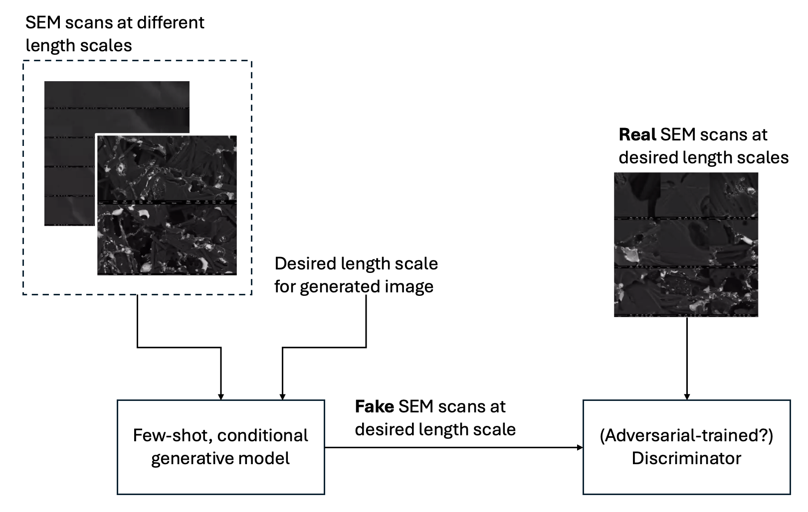

# Deep Faker Project

## Contributors
**Ju Li Group**  
Massachusetts Institute of Technology  

---

## Overview

Understanding the intricate relationships between synthesis recipes, structure, and properties in materials science remains a challenging and pressing issue. Central to this endeavor is the question of how materials behave across different length scales. How can insights from the atomistic scale translate to bulk properties, and vice versa? To address these questions, we focus on two fundamental problems: the **Counting Problem** and the **Enough Problem**.



*Figure 1: Potential framework for information quantification in SEM images.*

---

## Counting Problem

### Problem Definition

A core objective of materials science is to establish relationships between a material's structure and its observed properties. For complex phenomena, like electrochemistry, it is essential to consider multiple length scales to achieve a comprehensive understanding. Scanning Electron Microscopy (SEM) is a vital tool for analyzing material structures, while Electrochemical Surface Area (ECSA) is a key electrochemical parameter. 

This problem asks: how much of the predicted ECSA ratio can we explain using SEM imaging alone? To achieve a complete understanding, it may be necessary to integrate data from other techniques, such as Scanning Tunneling Microscopy (STM) and custom optical microscopy, thereby forming a truly multiscale relationship between structure and properties.

### Project Direction and Key Deliverables

We aim to develop a model to quantify the nanoparticle (NP) size distribution visible on SEM scans. By extrapolating this distribution to include smaller, sub-resolution particles, we can estimate the fraction of NPs not captured by SEM imaging. This approach will help elucidate the multiscale nature of structure-property relationships in materials.

---

## Enough Problem

### Problem Definition

Materials scientists have access to powerful tools, such as SEM, that enable imaging across various length scales. However, a key question arises: how much information is required to faithfully capture a material's structure at different length scales?

The "enough" problem investigates this by leveraging deep generative models. A pre-trained model is conditioned on SEM images at multiple length scales and tasked with generating synthetic SEM scans at new scales. If the synthetic images are indistinguishable from real ones, we hypothesize that the provided data contains sufficient information to represent the material's structure. 

By quantifying the number of images needed at each length scale to train such a model, we aim to create an information-theoretic framework for understanding material structure across scales.

### Project Direction and Key Deliverables

We propose a framework that uses few-shot learning with a generative model to generate synthetic SEM images at desired length scales. A discriminator will evaluate whether the generated images are indistinguishable from real SEM scans. By iterating this process across multiple scales, we can plot the relationship between required image information and length scale, providing a quantitative understanding of structural detail at each level.

---

## Interplay Between the Counting and Enough Problems

The "counting" problem addresses the instruments and length scales necessary to connect structure and property. The "enough" problem quantifies the information content at each length scale. These problems are complementary, as the counting problem determines the significance of detail at various scales, while the enough problem quantifies how much detail is sufficient to represent the material. 

Together, these approaches can test hypotheses about the optimal length scales for capturing relevant material properties, paving the way for a deeper understanding of multiscale materials science.

---

## Environment Setup

To set up the environment for the project, follow these steps:

```bash
# Clone the repository
git clone https://github.com/yuyao-mit/deep_faker
cd deep_faker

# Create and activate a Python virtual environment
python3 -m venv venv
source venv/bin/activate  # For Linux/macOS
# On Windows, use: venv\Scripts\activate

# Install required dependencies
pip install -r requirements.txt

# Verify the environment setup
python -m pip check

```
